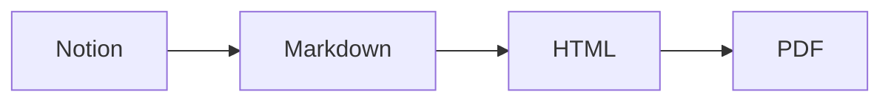

<link rel="stylesheet" href="https://cdn.jsdelivr.net/gh/kuroyei/Markdown-CSS/sindresorhus_github-markdown-css_github-markdown-light.css">
<link rel="stylesheet" href="https://cdn.jsdelivr.net/gh/kuroyei/Markdown-CSS/style.css">
<style>
:root {
    /* 基本的なフォントファミリー */
    /* --font-base: ; */

    /* 等幅フォントファミリー */
    /* --font-code: ; */

    /* コードブロックのフォントサイズ */
    /* --font-size-codeblock: ; */
}
</style>

<h1 id="title">
Markdown CSS
</h1>
<address id="author">
<span class="mono">4I14</span> &emsp; 黒江 遺産
</address>
<time id="date">
2024年10月8日
</time>

Visual Studio Code の拡張機能「Markdown All in One」により Markdown から生成した HTML に対して適用するための CSS である．レポートの作成に使用することを想定している．

<div style="text-align: center">

<span style="font-size:2.488em">:turtle:</span>
<span style="font-size:2.074em">:turtle:</span>
<span style="font-size:1.728em">:turtle:</span>
<span style="font-size:1.44em">:turtle:</span>
<span style="font-size:1.2em">:turtle:</span>
<span style="font-size:1em">:turtle:</span>
<span style="font-size:0.9em">:turtle:</span>
<span style="font-size:0.8em">:turtle:</span>
<span style="font-size:0.7em">:turtle:</span>
<span style="font-size:0.5em">:turtle:</span>

</div>

- [デモ](#デモ)
- [インストール](#インストール)
- [設定](#設定)
- [使用方法](#使用方法)
- [独自の要素](#独自の要素)
- [置換](#置換)
- [注意](#注意)
- [記法](#記法)
- [例](#例)
  - [数式](#数式)
  - [2カラム](#2カラム)
  - [画像](#画像)
  - [Mermaid](#mermaid)


## デモ

- [Markdown](https://github.com/kuroyei/Markdown-CSS/blob/main/demo/demo.md?plain=1)
- [HTML](https://kuroyei.com/demo/Markdown-CSS/demo.html)
- [PDF](https://kuroyei.com/demo/Markdown-CSS/demo.pdf)

## インストール

- [Markdown All in One](https://marketplace.visualstudio.com/items?itemName=yzhang.markdown-all-in-one)
- [Markdown Preview Mermaid Support](https://marketplace.visualstudio.com/items?itemName=bierner.markdown-mermaid) (for Mermaid ダイアグラム)
- [Markdown Emoji](https://marketplace.visualstudio.com/items?itemName=bierner.markdown-emoji) (for 絵文字)
- [Markdown Footnotes](https://marketplace.visualstudio.com/items?itemName=bierner.markdown-footnotes) (for 脚注)

<div class="break-after"></div>

## 設定

<kbd>Ctrl</kbd> + <kbd>,</kbd> により VSCode の設定を開き、拡張機能 Markdown All in One について次のように設定する．

```json
{
  "markdown.extension.print.absoluteImgPath": false,
  "markdown.extension.print.includeVscodeStylesheets": false
}
```

## 使用方法

次のコードを Markdown の先頭に貼り付ける．

```html
<link rel="stylesheet" href="https://cdn.jsdelivr.net/gh/kuroyei/Markdown-CSS/sindresorhus_github-markdown-css_github-markdown-light.css">
<link rel="stylesheet" href="https://cdn.jsdelivr.net/gh/kuroyei/Markdown-CSS/style.css">

<style>
:root {
    /* 基本的なフォントファミリー */
    /* --font-base: ; */

    /* 等幅フォントファミリー */
    /* --font-code: ; */

    /* コードブロックのフォントサイズ */
    /* --font-size-codeblock: ; */
}
</style>
```

> [!NOTE]
> 自身でフォント等を変更したい場合は `<style>` を編集する．

## 独自の要素

- 文書名・著者名・日付

    ```html
    <h1 id="title">
    Markdown でレポートを書こう
    </h1>
    <address id="author">
    <span class="mono">4I14</span> &emsp; 黒江 遺産
    </address>
    <time id="date">
    2024年10月8日
    </time>
    ```

- 等幅フォントで表示

    `class="mono"` を指定する．

- 2カラム

    ```html
    <div class="column-wrapper">
    <div class="column-left">

    左側のコンテンツ

    </div>
    <div class="column-right">

    右側のコンテンツ

    </div>
    </div>
    ```

- 途中で改ページさせない

    ```html
    <div class="avoid-break">

    印刷時に改ページさせたくないコンテンツ

    </div>
    ```

- その場で改ページする

    ```html
    <div class="break-after"></div>
    ```

## 置換

> [!NOTE]
> [`.*`] は正規表現を用いることを意味する．

- 画像

    画像の幅を調整できるようにする．また、画像の下にキャプションが表示されるようにする．

    <table>
    <thead>
    <tr>
    <th>Find [<code>.*</code>]</th>
    <th>Replace</th>
    </tr>
    </thead>
    <tbody>
    <tr>
    <td>

    ```regex
    !\[(.*)\]\((.*?)\)
    ```

    </td>
    <td>

    ```html
    <figure style="width: 70%">
    
    <figcaption>

    $1

    </figcaption>
    </figure>
    ```

    </td>
    </tr>
    </tbody>
    </table>

## 注意

- 印刷時はオプション「背景のグラフィック」を有効にすること．

## 記法

- [基本的な書き方とフォーマットの構文 - GitHub Docs](https://docs.github.com/ja/get-started/writing-on-github/getting-started-with-writing-and-formatting-on-github/basic-writing-and-formatting-syntax)
- [情報を表に編成する - GitHub Docs](https://docs.github.com/ja/get-started/writing-on-github/working-with-advanced-formatting/organizing-information-with-tables)
- [コードブロックの作成と強調表示 - GitHub Docs](https://docs.github.com/ja/get-started/writing-on-github/working-with-advanced-formatting/creating-and-highlighting-code-blocks)
- [ダイアグラムの作成 - GitHub Docs](https://docs.github.com/ja/get-started/writing-on-github/working-with-advanced-formatting/creating-diagrams)

## 例

### 数式

ネイピア数 $\mathrm{e}$ や微小量を表す $\mathrm{d}$ を立体 (ローマン体) で書くのが好きです！

$$
\newcommand\ntsize[1]{{\footnotesize #1}}
\begin{align*}
\int_{-\infty}^\infty {\rm e}^{-x^2} \,{\rm d} x = \sqrt\pi &&(\ntsize{\textsf{ガウス積分}})
\end{align*}
$$

### 2カラム

<div class="column-wrapper">
<div style="flex-basis: 70%;">

```latex
\overset{
    {\Huge\bigcirc} \!\!\!\!\!\!\!\!\!\!\!\!\!\! \overset{{{}^{\#\#\#}}}{{}^{{}^{^\frown} \Box {}^{^\frown}}}
}{
    \overset{\circ}{\lfloor}
    \left({}^{^{\normalsize \partial}} \forall {}^{^{\normalsize\partial}}\right)
    \overset{\circ}{\rfloor}
}
```

</div>
<div style="flex-basis: 30%;">

$$
{
    \overset{
        {\Huge\bigcirc} \!\!\!\!\!\!\!\!\!\!\!\!\!\! \overset{{{}^{\#\#\#}}}{{}^{{}^{^\frown} \Box {}^{^\frown}}}
    }{
        \overset{\circ}{\lfloor}
        \left({}^{^{\normalsize \partial}} \forall {}^{^{\normalsize\partial}}\right)
        \overset{\circ}{\rfloor}
    }
}
$$

</div>
</div>

### 画像

<figure style="width: 70%">

<figcaption>

ぱそぱそ

</figcaption>
</figure>

### Mermaid

くろえいさん:four_leaf_clover: はいつも次のような流れでレポートを執筆しています．


