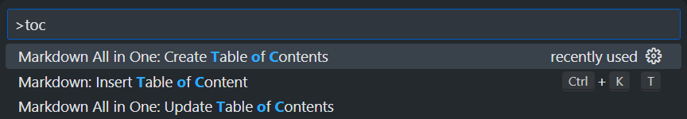
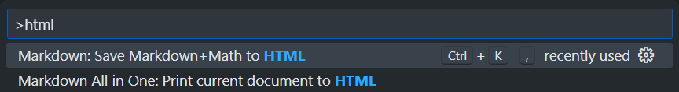

<link rel="stylesheet" href="https://cdn.jsdelivr.net/gh/kuroyei/Markdown-CSS/mdmath/style.css">
<script src="https://unpkg.com/mermaid/dist/mermaid.min.js"></script>
<script>
  mermaid.initialize({
      startOnLoad: true, 
      theme: 'defalt'
  });
</script>
<div id="title">

Markdown でレポートを書こう

</div>

<div id="author-date">

4年14席 &emsp; 黒江 遺産

2024年 5月 16日

</div>

- [インストールするもの](#インストールするもの)
- [流れ](#流れ)
- [レポート執筆](#レポート執筆)
- [Markdown を編集](#markdown-を編集)
- [HTML に変換](#html-に変換)
- [PDF に変換](#pdf-に変換)

$$
\overset{
{\Huge\bigcirc} \!\!\!\!\!\!\!\!\!\!\!\!\!\! \overset{{{}^{\#\#\#}}}{{}^{{}^{^\frown} \Box {}^{^\frown}}}
}{
\overset{\circ}{\lfloor}\left(
{}^{^{\normalsize \partial}} \forall {}^{^{\normalsize\partial}} 
\right)\overset{\circ}{\rfloor}
}
$$

## インストールするもの

- Visual Studio Code
- VSCode 拡張機能 [Markdown+Math](https://marketplace.visualstudio.com/items?itemName=goessner.mdmath)
- VSCode 拡張機能 [Markdown All in One](https://marketplace.visualstudio.com/items?itemName=yzhang.markdown-all-in-one)

## 流れ

<div class="mermaid">
flowchart LR
    Notion --> Markdown --> HTML --> PDF
</div>

## レポート執筆

私はいつも Notion で書いている．レポートを書き終えたら、Markdown にエクスポートする．

$\KaTeX$ 数式において、本文中の文字と同程度のサイズのテキストを置きたい場合は `\footnotesize` を用いる．私は `\ntsize{}` (Normal Text Size) というコマンドを定義して簡単に footnotesize になるようにしている．

```latex
\newcommand\ntsize[1]{{\footnotesize #1}}
f(x) \sim \sum_{n=-\infty}^\infty C_n \exp\left(i \frac{n\pi}{l}x\right) \quad (\ntsize{\textsf{複素フーリエ級数}})
```

$$
\newcommand\ntsize[1]{{\footnotesize #1}}
f(x) \sim \sum_{n=-\infty}^\infty C_n \exp\left(i \frac{n\pi}{l}x\right) \quad (\ntsize{\textsf{複素フーリエ級数}})
$$

## Markdown を編集

次の操作を行う．Notion を使用しない場合は一部操作は不要である．

1. 見出しのレベルを下げる

    Notion では `h1` から使用するが、これはタイトル用であるため過剰に大きく表示される．そのため、一段階レベルを下げる．
    
    VSCode 上で正規表現を用いて置換を行う．左のコードを「Find」、右のコードを「Replace」に貼りつける．「Find」入力フォーム右の「Use Regular Expression `.*`」を有効にすること．

    <div class="column-wrapper">
    <div class="column-left">

    ```
    ^\n^#
    ```

    </div>
    <div class="column-right">

    ```
    \n##
    ```

    </div>
    </div>

2. タイトルを専用タグで囲む

    タイトルには `h1` タグを使用しても良いが、私は中央揃えに表示させるために次のようにしている．

    ```html
    <div id="title">

    タイトル

    </div>
    ```

3. 著者と日付

    タイトルの下に置く．

    ```html
    <div id="author-date">

    3年17席 &emsp; 黒江 遺産

    2024年 5月 16日

    </div>
    ```

4. 画像幅の調整

    デフォルトでは幅一杯に画像が表示されるため、幅を調整する．

    <div class="column-wrapper">
    <div class="column-left">

    ```
    !\[.*?\]\((.*?)\)
    ```

    </div>
    <div class="column-right">

    ```
    <div align="center"></div>
    ```

    </div>
    </div>

<div style="page-break-after: always;"></div>

5. 目次の作成

    著者と日付の下に目次を作成する．拡張機能「Markdown All in One」の機能を用いる．

    <div align="center"></div>

次に Markdown の先頭に次のコードを貼り付ける．

```html
<link rel="stylesheet" href="https://cdn.jsdelivr.net/gh/kuroyei/Markdown-CSS/mdmath/style.css">
<script>
  mermaid.initialize({
      startOnLoad: true, 
      theme: 'defalt'
  });
</script>
```

## HTML に変換

拡張機能「Markdown All in One」の機能を用いる．「Save Markdown+Math to HTML」の方を選択する．

<div align="center"></div>

## PDF に変換

私の Markdown 用の CSS は Chrome で使用することを想定している．

印刷プレビューを見て、望ましくない改ページがある場合は該当する箇所にコードを追加する．

- 途中の改ページを防ぐ

    ```html
    <div style="break-inside: avoid">

    印刷時に改ページさせたくないコンテンツ

    </div>
    ```

- その場で改ページする

    ```html
    <div style="page-break-after: always;"></div>
    ```

